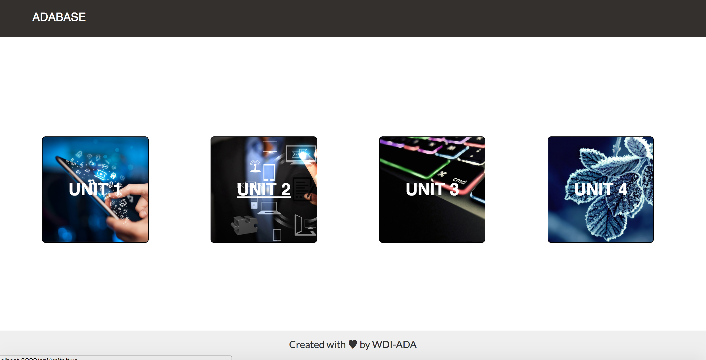
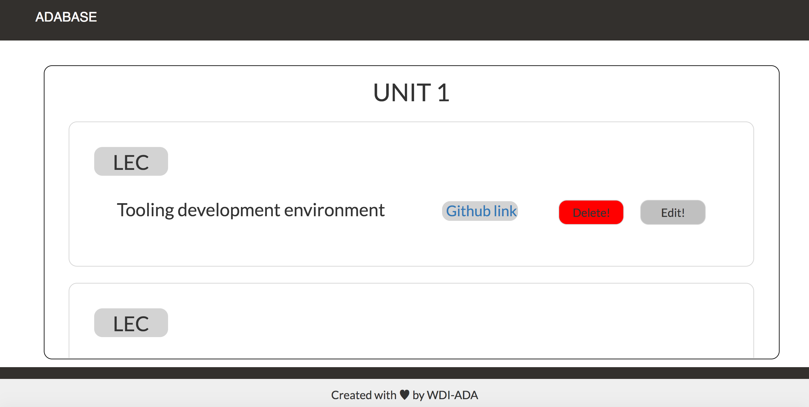
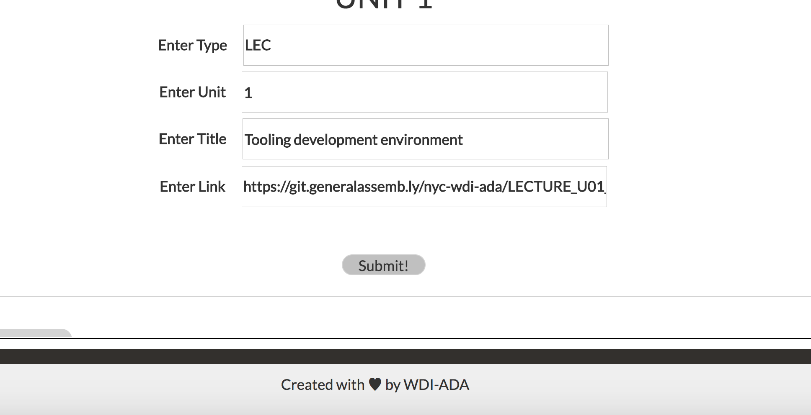
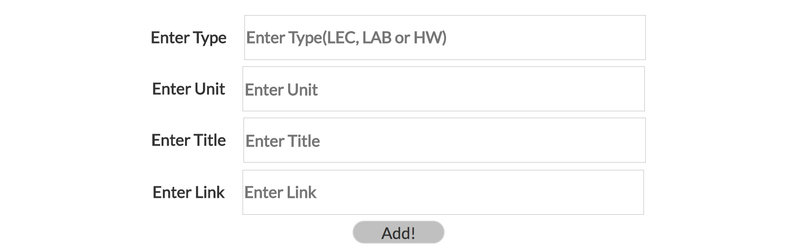

# project_3
project 3 ada library

##OVERVIEW

The basic idea of this app is to provide the user to add a lecture,homework or labs in four different units along with the git.generalassemb.ly link and to edit and delete the information on these homeworks, labs and lectures.

##Necessary Features
1. Provide the list of lectures, labs and homeworks in all the four units.
2. To let the user to add a new unit along with the git.generalassemb.ly link
3. To let the user to delete the unnecessary lecture or homework or lab.

##Advance Features
1. To implement passport authentication.
2. To make the admin account as primary and only the admin can do all the CRUD functionality.
3. To render the objective of each lecture and homework and lesson, so that the public can get a gist of what course material GA has. This is because every unit has GA's git link attached to it and is solely for only GA students.

##Wireframes
<!---->





##Database Structure
1. Initial thoughts of database structure was MongoDb and Mongoose library.
2. Below is a simple example of our database structure.
```
 {
    "unit" : 1,
    "type" : "LEC",
    "title" : "Tooling development environment",
    "objective" : "Listing necessary tools in Computer programming and web development. Describing each, and identifying their benefits.",
    "github" : "https://git.generalassemb.ly/nyc-wdi-ada/LECTURE_U01_D01_Tooling",
    "resources" : [
      {
        "website" : "Youtube",
        "url" : "www.youtube.com"
      }
    ]
}
```

##Resources
1. [https://scotch.io/tutorials/using-mongoosejs-in-node-js-and-mongodb-applications]
2. [http://mongoosejs.com/docs/]
3. [https://docs.mongodb.com/manual/reference/]
4. [https://facebook.github.io/react/]
5. [https://github.com/facebookincubator/create-react-app]